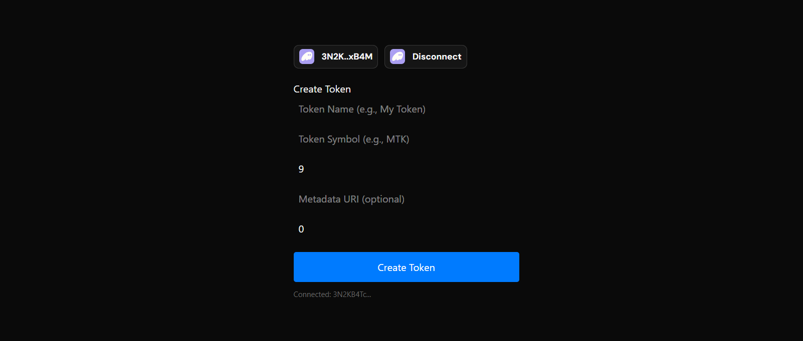

# 🔥 Solana Token Creator dApp

Create your own fungible tokens on the **Solana blockchain** with metadata — just like ERC-20 but on Solana! This dApp allows users to:

- 🪙 Create a custom SPL token
- 🏷️ Attach metadata (name, symbol, URI) using Metaplex
- 💰 Optionally mint initial supply to their wallet

> Built using Anchor, Wallet Adapter, and React. No CLI needed — just connect wallet and click.

---

## 🚀 Preview
- Deployed Program Id: 44v2qXt8mpWDvUvAeYD2e9GLWbqDbVZmy6xL8VA8LVgp

---

## 🛠 Tech Stack

- [Solana](https://solana.com/)
- [Anchor Framework](https://book.anchor-lang.com/)
- [React](https://reactjs.org/)
- [Next.js](https://nextjs.org/)
- [@solana/wallet-adapter](https://github.com/solana-labs/wallet-adapter)
- [@metaplex-foundation/mpl-token-metadata](https://github.com/metaplex-foundation/mpl-token-metadata)
- [SPL Token JS](https://github.com/solana-labs/solana-program-library/tree/master/token/js)

---
